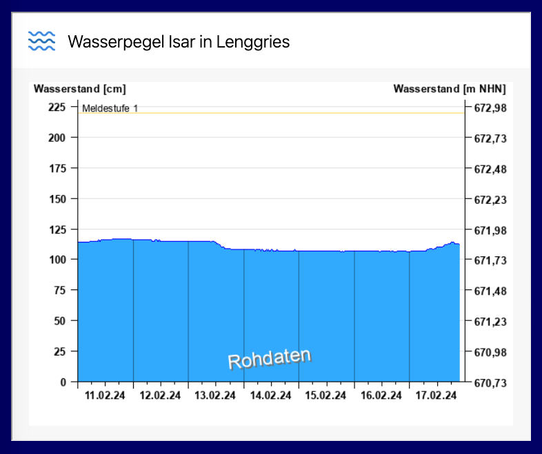

# River Levels Widget

An iframe widget showing a chart of river levels served as an image from a specified URL. See the [on-line demo].

```json
{
  "title": "Wasserpegel Isar in Lenggries",
  "image": "https://www.hnd.bayern.de/webservices/graphik.php?
    cache=hnd&statnr=16003003&thema=hochwasser.meldestufen&
    wert=wasserstand&vhs=false&geber=0"
}
```



## Usage

The widget can be placed on a page as an `iframe` element pointing its `src` attribute to a URL of `river-levels.html`. The URL has to contain a query parameter `rex-widgets-iframe-guest` set to a unique identifier, if there're more widgets on the same page.

The widget requires initialisation and passing two parameters in a script :

| Name    | Type     | Description                                                          |
|:--------|:---------|:---------------------------------------------------------------------|
| `title` | `string` | title to set to the iframe document and display in the iframe header |
| `image` | `string` | URL of the image to show in the iframe body                          |

The widget communicates with the main page using window messages. the file [`iframe.host.js`](iframe.host.js) contains an example of an implementation.

How to wire up a page:

```html
<script type="module">
  import { addGuest } from './iframe.host.js'

  const widgetData = {
    title: 'Wasserpegel Isar in Lenggries',
    image: 'river-levels-isar-lenggries.png' // use a local image during the development
    // image: 'https://www.hnd.bayern.de/webservices/graphik.php?
    //          cache=hnd&statnr=16003003&thema=hochwasser.meldestufen&
    //          wert=wasserstand&vhs=false&geber=0'
  }
  const iframeOrigin = location.origin
  addGuest(widgetData, iframeOrigin)
</script>

<iframe src="https://prantlf.github.io/river-levels/river-levels.html?rex-widgets-iframe-guest=1"></iframe>
```

See a complete example in the file [`index.html`](index.html), which is deployed to GitHub pages as an [on-line demo].

## Contents

The widget (guest) consists of the following assets:

* `river-levels.html` - HTML contents of the iframe
* `iframe.guest.js` - library for communicating with the main page
* `river-levels.png` - logo displayed by the widget

The page (host) consists of the following assets:

* `index.html` - HTML contents of the page
* `iframe.host.js` - library for communicating with the iframe
* `river-levels-isar-lenggries.png` - fixed image content not to drain the image service so much during the development

* `river-levels.json` - JSON schema of a widget configurable for any river
* `river-levels-isar-lenggries.json` - JSON schema of a widget showing the water level of Isar at Lenggries

## Contributing

In lieu of a formal styleguide, take care to maintain the existing coding style. Lint and test your code using `npm test`.

## License

Copyright (c) 2024 Ferdinand Prantl

Licensed under the MIT license.

[on-line demo]: https://prantlf.github.io/river-levels
